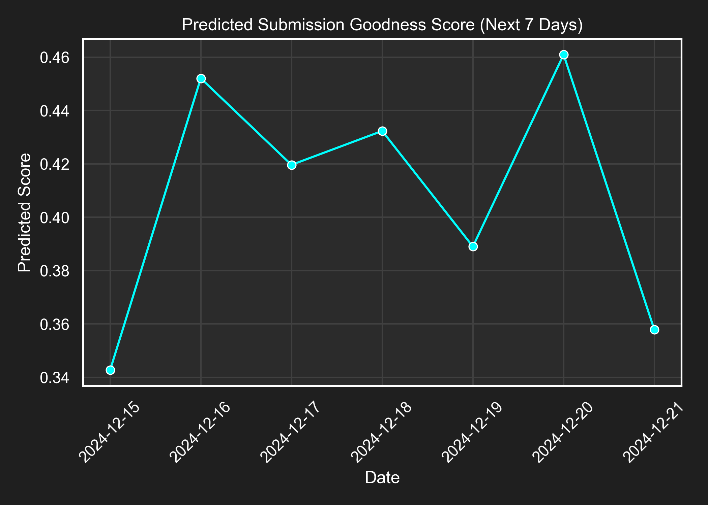

# 论文投稿时间选择器
这是一个一个基于投稿时间、期刊政策和文本因素的论文接受率评分模型来选择投稿的良辰吉日。
2025年的投稿评分已预先计算完成,可在 [don-yin.uk/submission](https://don-yin.uk/submission) 查看。

For English see [Here](README-en.md).

## 考虑的影响因素
| 研究            | 影响                             |
|-----------------|--------------------------------|
| Ausloos等 2019a | 专业期刊与跨学科期刊的季节性偏差 |
| Ausloos等 2019b | 熵/多样性指数反映季节性模式      |
| Putman等 2022   | 周末投稿更容易被直接拒稿         |
| Ausloos等 2017  | 投稿中的ARCH类时间模式           |
| Boja等 2018     | 星期几影响接受概率               |
| Meng等 2020     | 月初出现已接受论文的激增         |
| Shalvi等 2010   | 夏季投稿在心理学领域接受率较低   |
| Schreiber 2012  | 物理学领域七月份接受率最高       |
| Sweedler 2020   | 简短标题和工作日投稿更有利       |

## 使用方法
- 使用 `date_to_score(date_str, model)` 预测特定日期的评分
- 多次运行以获得平均分数(由于不同类型期刊/主题的随机性)
- 参见 `year.py` 示例

(注：分数越高越好)

## 参考文献
1. Ausloos, M., Nedič, O., & Dekanski, A. (2019a). 同行评议期刊中论文投稿和接受的相关性. *Scientometrics*, *119*(1), 279-302. https://doi.org/10.1007/s11192-019-03026-x

2. Ausloos, M., Nedic, O., & Dekanski, A. (2019b). 同行评议期刊中投稿和接受论文分布的季节性熵、多样性和不平等度量. *Entropy*, *21*(6), 564. https://doi.org/10.3390/e21060564

3. Putman, M., Berquist, J. B., Ruderman, E. M., & Sparks, J. A. (2022). 任何周一：风湿病学期刊周末投稿与直接拒稿的关联. *The Journal of Rheumatology*, *49*(6), 652-653. https://doi.org/10.3899/jrheum.220099

4. Ausloos, M., Nedic, O., Dekanski, A., Mrowinski, M. J., Fronczak, P., & Fronczak, A. (2017). 同行评议期刊论文投稿/接受/拒绝的星期效应. II. ARCH计量经济学类建模. *Physica A: Statistical Mechanics and its Applications*, *468*, 462-474. https://doi.org/10.1016/j.physa.2016.10.078

5. Boja, C. E., Herţeliu, C., Dârdală, M., & Ileanu, B. V. (2018). Physica A、PLOS ONE、Nature和Cell期刊已接受论文的星期投稿效应. *Scientometrics*, *117*(2), 887-918. https://doi.org/10.1007/s11192-018-2911-7

6. Meng, L., Wang, H., & Han, P. (2020). 抢占先机：管理学期刊已接受论文的月初投稿效应. *Scientometrics*, *124*(3), 2577-2595. https://doi.org/10.1007/s11192-020-03556-9

7. Shalvi, S., Baas, M., Handgraaf, M. J. J., & De Dreu, C. K. W. (2010). 热时写作 — 冷时投稿：同行评议或接受中的季节性偏差？ *Learned Publishing*, *23*(2), 117-123. https://doi.org/10.1087/20100206

8. Schreiber, M. (2012). 物理学期刊编辑决策的季节性偏差：你可以随时写作，但要在七月投稿. *Learned Publishing*, *25*(2), 145-151. https://doi.org/10.1087/20120209

9. Sweedler, J. V. (2020). 给作者的奇怪建议：在工作日投稿时使用简短标题. *Analytical Chemistry*, *92*(3), 2351-2352. https://doi.org/10.1021/acs.analchem.0c00223

# 备注
转载请引用出处